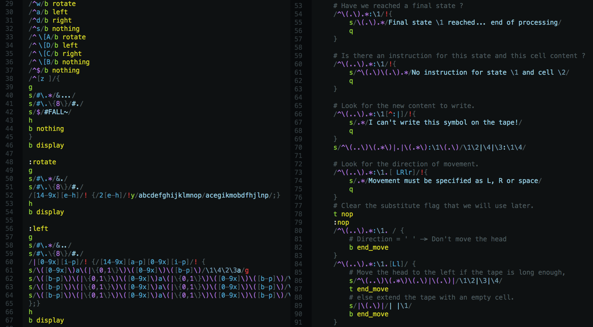

`sed` script syntax highlighting
================================

The package does exactly what the heading advertises: adds syntax highlighting
to [`sed(1)`](https://linux.die.net/man/1/sed) scripts for Atom:

Language reference
------------------
* [GNU `sed` texinfo manual](https://www.gnu.org/software/sed/manual/sed.html)
* [An introduction to `sed`](http://www.grymoire.com/Unix/Sed.html)
